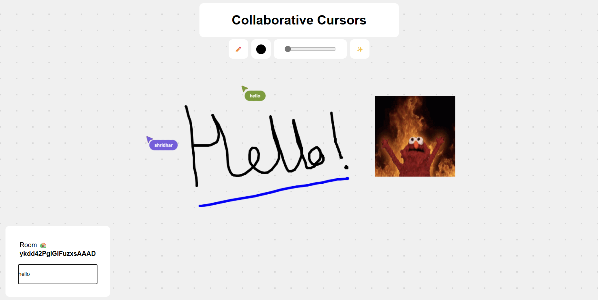

# Collaborative Cursors
### Figma-like collaborative cursor using socketio

## Features

- Realtime Cursors 🌐 
- 4000 x 4000 px draggable canvas area 🟩
- Rooms 🏡
- Drawing ✏️
- Stroke width size ⭕
- Colors 🎨
- GIFS ✨

## Tech Stack

- NodeJS ⚙️ 
- ExpressJS 🚂
- Socket.io 🔌
- JavaScript 🌐
- HTML 🧱 
- CSS 🖌️

